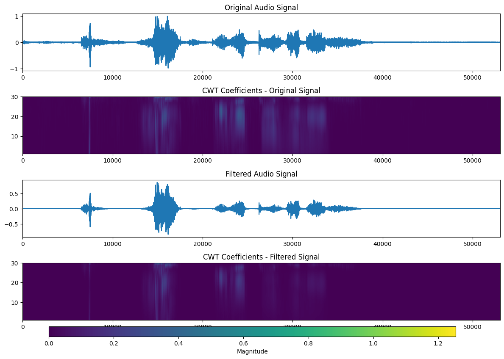
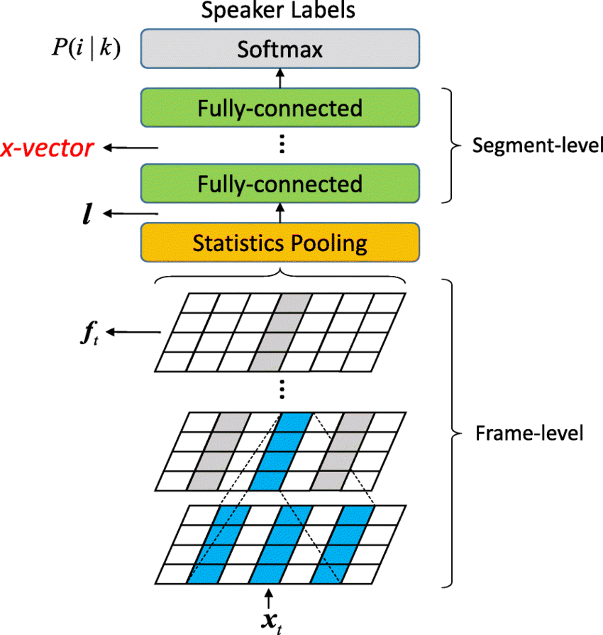
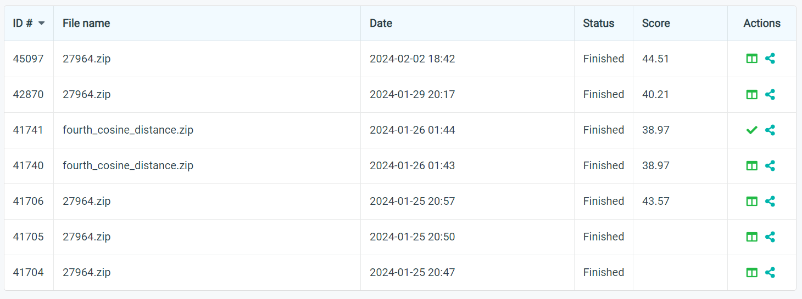

# Signal Processing Cup 2024 - Team EigenSharks

This repository contains files related to the Signal Processing Cup 2024 competition by Team EigenSharks. 

## Contents

- [Problem Statement : RoboVox: Far-field speaker recognition by a mobile robot](#problem-statement--robovox-far-field-speaker-recognition-by-a-mobile-robot)
  - [Introduction](#introduction)
  - [Task description](#task-description)
  - [Robovox tasks](#robovox-tasks)

- [Folders](#folders)
  - [Explore Dataset](#explore-dataset)
  - [Denoising](#denoising)
  - [Feature Extraction](#feature-extraction)
  - [French Audio Generation](#french-audio-generation)
  - [Speaker_recognition](#speaker-recognition)
  - [Submissions](#submissions)

___

## Folders

### Denoising

This folder contains the code for the denoising task using Matlab and Python implementations. **Continuous Wavelet Transform** has been used for denoising.

### Explore Dataset

This folder contains the code for exploring the dataset. The code is written in Python and uses the `librosa` library for audio processing. The code is divided into two main files: `explore_dataset.py` and `explore_dataset.ipynb`. The former is a Python script that can be run from the command line, while the latter is a Jupyter notebook that can be run interactively.

### Feature Extraction

This folder contains the code for extracting features from the audio files.

The following figure shows the architecture of the x-vector model used for feature extraction:

- paper - [Xvector Paper](https://www.danielpovey.com/files/2018_icassp_xvectors.pdf)

- from_scratch.ipynb - Extract features from the noisy audio files

- from_scratch_denoised_version.ipynb = Extract features from the denoised audio files

- avg_xvectors_from_scratch_densoised_version.ipynb - Extract features from the denoised audio files using the average of the x-vectors for each speaker

- English_xvector_from_scratch_denoised_version.ipynb - Extract features from the denoised audio files using SpeechBrain's pretrained x-vector model

- Transfer Learning Jtubespeech.ipynb - Use transfer learning to train JtubeSpeech's x-vector model on the denoised French Audio dataset

### French Audio Generation

`French_Audio_Generation.ipynb` contains code for synthesizing French audio using **Google Text-to-Speech** and **pyttsx3**.

### Speaker recognition

`I_go_from_scratch.ipynb` contains code for attempt to train a speaker recognition model from scratch using _Triplet Loss_.

### Submissions

**fourth_submission.zip** - This gave the best result on the leaderboard. `from_scratch_denoised_version.ipynb` was used to generate the submission file.

`submission_template.py` - A python script to generate the submission file, by simply changing the model architecture.

___

## Problem Statement : RoboVox: Far-field speaker recognition by a mobile robot

### Introduction

A speaker recognition system authenticates the identity of claimed users from a speech utterance. For a given speech segment called enrollment and a speech segment from a claimed user, the speaker recognition system will determine automatically whether both segments belong to the same speaker or not. The state-of-the-art speaker recognition systems mainly use deep neural networks to extract speaker discriminant features called speaker embeddings.

The DNN-based speaker verification systems perform well in general, but there are some challenges that reduce their performance dramatically. Far-field speaker recognition is among the well-known challenges facing speaker recognition systems. The far-field challenge is intertwined with other variabilities such as noise and reverberation. Two main categories of speaker recognition systems are text-dependent speaker recognition vs text-independent speaker recognition. In a text-dependent speaker recognition system, the speaker’s voice is recorded from predefined phrases, while, in text-independent speaker recognition, there is no constraint on the content of the spoken dialogue. The task of the IEEE Signal Processing Cup 2024 is text-independent far-filed speaker recognition under noise and reverberation for a mobile robot.

## Task description

The Robovox challenge is concerned with doing far-field speaker verification from speech signals recorded by a mobile robot at variable distances in the presence of noise and reverberation. Although there are some benchmarks in this domain such as VoiCes and FFSVC, they don’t cover variabilities in the domain of robotics such as the robot’s internal noise and the angle between the speaker and the robot. The VoiCes dataset is replayed speech recorded under different acoustical noises. A main drawback of the VoiCes is that it was recorded from played signals whereas our dataset is recorded with people speaking in noisy environments. The FFSVC is another far-field speaker recognition benchmark. However, these benchmarks helped the community significantly, we are introducing a new benchmark for far-field speaker recognition systems in order to address some new aspects. Firstly, our goal is to perform speaker recognition in a real application for the domain of mobile robots. In this domain, there are other variabilities that have not been addressed in previous benchmarks: the robot’s internal noise and the angle between the speaker and the robot. Furthermore, the speech signal has been recorded for different distances between the speaker and the robot. In the proposed challenge the following variabilities are present:

- Ambient noise leading to low signal-to-noise ratios (SNR): The speech signal is distorted with noise from fans, air conditioners, heaters, computers, etc.
- Internal robot noises (robot activators): The robot’s activator noise reverberates on the audio sensors and degrades the SNR.
- Reverberation: The phenomena of reverberation due to the configuration of the places where the robot is located. The robot is used in different rooms with different surface textures and different room shapes and sizes.
- Distance: The distance between the robot and speakers is not fixed and it is possible for the robot to move during the recognition.
- Babble noise: The potential presence of several speakers speaking simultaneously.
- Angle: The angle between speakers and the robot’s microphones

## Robovox tasks

In this challenge, two tracks will be proposed:

1. **Far-field single-channel tracks**: In this task, one channel is used to perform the speaker verification. The main objective is to propose novel robust speaker recognition pipelines to tackle the problem of far-field speaker recognition in the presence of reverberation and noise.

2. **Far-field multi-channel tracks**: In this task, several channels are used to perform speaker verification. The main objective is to develop algorithms that improve the performance of multi-channel speaker verification systems under severe noise and reverberation.